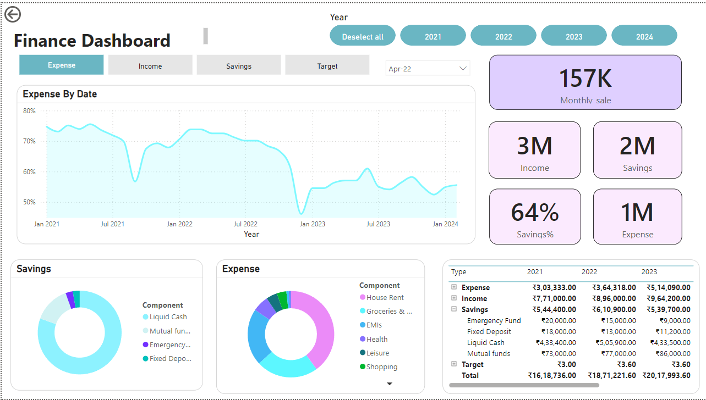

# 📊 Finance Dashboard

## Overview
This **Finance Dashboard** provides an intuitive and visual representation of key financial metrics to help track performance over multiple years. Built using **Power BI**, the dashboard enables users to monitor expenses, savings, income, and other financial KPIs over a selected period. The visualized data makes it easier to spot trends, analyze spending habits, and make informed decisions to improve financial health.

## Key Features
- **Expense Analysis**: Visualize expenses over time with the line chart that tracks expenses from 2021 to 2024, enabling the user to monitor fluctuations and trends across the years.
- **Monthly Sales Insight**: Quick access to the latest monthly sales figure, prominently displayed at the top-right corner of the dashboard.
- **Income and Savings Summary**: Get a snapshot of total income, savings, and expense figures with KPIs showing totals for the current period.
- **Savings Percentage**: Understand how much of your income is being saved, with a quick visual percentage to track financial discipline.
- **Category Breakdown**: 
  - **Savings Breakdown**: See the distribution of your savings across categories like Liquid Cash, Mutual Funds, Emergency Funds, and Fixed Deposits using a pie chart.
  - **Expense Breakdown**: Analyze expenses by category, including House Rent, Groceries, EMIs, Health, Leisure, and Shopping.
- **Year Filter**: Easily filter the data by year (2021, 2022, 2023, 2024) to examine financial metrics for specific timeframes.

## Screenshot Overview
- **Top Section**: 
  - The expense trends over time are illustrated with a line chart.
  - Key metrics for monthly sales, income, savings, savings percentage, and total expenses are shown in visually distinct cards.
- **Bottom Section**:
  - Pie charts show the breakdown of savings and expenses across different categories, making it easy to identify where funds are allocated.
  - A detailed table lists yearly figures for expenses, income, and savings, giving a comprehensive view of financial performance over the years.

## Data Categories
- **Expense**: Monthly expenses tracked across multiple years and visualized in both the chart and the detailed data table.
- **Income**: Income data is recorded annually, and displayed in key performance indicators (KPIs) and a data table.
- **Savings**: This includes various types of savings like Emergency Funds, Fixed Deposits, and Mutual Funds, broken down by type in both the pie chart and table.
- **Expense Categories**: Breakdowns include House Rent, Groceries, EMIs, Health, Leisure, and Shopping.

## How to Use

### Download the Dashboard
To view and interact with the dashboard:
1. Download the `.pbix` file (Power BI file) containing the dashboard.
2. Open the file using [Power BI Desktop](https://powerbi.microsoft.com/desktop/).

### Interact with the Dashboard
- **Year Selection**: Use the year filter to focus on specific time frames and see how financials have evolved over time.
- **Hover Over Data**: Get detailed insights by hovering over data points in the line chart and pie charts for in-depth information.
- **Custom Filtering**: Apply custom filters for specific dates or expense categories to analyze particular areas of interest.

## Customization
This dashboard is customizable to fit your own financial data:
- **Update Data Sources**: Replace the existing data with your own financial information to track your personal or business performance.
- **Modify Visuals**: Adjust the charts and KPIs to reflect metrics that are important to your financial goals.

## Conclusion
This **Finance Dashboard** is designed to provide a comprehensive overview of financial performance, allowing users to monitor expenses, track savings, and gain insights into key financial trends over time. The interactive features make it a powerful tool for budgeting, financial planning, and decision-making.

